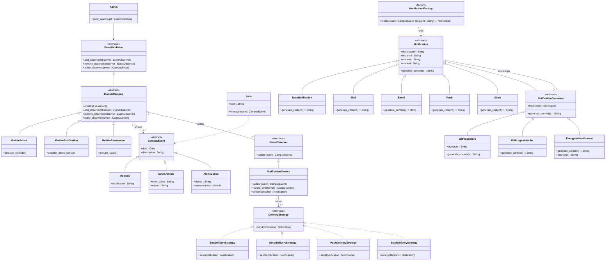

```mermaid
classDiagram
    direction TB

    class ModuleCampus {
        <<abstract>>
        +emettreEvenement()
        +add_observer(observer : EventObserver)
        +remove_observer(observer : EventObserver)
        +notify_observers(event : CampusEvent)
    }

    class ModuleAcces {
        +detecter_incendie()
    }

    class ModuleEcoGestion {
        +detecter_alerte_conso()
    }

    class ModuleReservation {
        +annuler_cours()
    }

    ModuleCampus <|-- ModuleAcces
    ModuleCampus <|-- ModuleEcoGestion
    ModuleCampus <|-- ModuleReservation

    class CampusEvent {
        <<abstract>>
        +date : Date
        +description : String
    }

    class Incendie {
        +localisation : String
    }

    class CoursAnnule {
        +nom_cours : String
        +raison : String
    }

    class AlerteConso {
        +niveau : String
        +consommation : double
    }

    class Salle {
        +nom : String
        +interagir(event : CampusEvent)
    }

    Salle ..> CampusEvent
    CampusEvent <|-- Incendie
    CampusEvent <|-- CoursAnnule
    CampusEvent <|-- AlerteConso

    ModuleCampus "1" --> "0..*" CampusEvent : produit

    class EventPublisher {
        <<interface>>
        +add_observer(observer : EventObserver)
        +remove_observer(observer : EventObserver)
        +notify_observers(event : CampusEvent)
    }

    class EventObserver {
        <<interface>>
        +update(event : CampusEvent)
    }

    class NotificationService {
        +update(event : CampusEvent)
        +handle_event(event : CampusEvent)
        +send(notification : Notification)
    }

    class Admin {
        +gerer_sujet(sujet : EventPublisher)
    }

    Admin --> EventPublisher 
    EventPublisher <|.. ModuleCampus
    EventObserver <|.. NotificationService

    ModuleCampus "1" o-- "0..*" EventObserver : notifie

    class DeliveryStrategy {
        <<interface>>
        +send(notification : Notification)
    }

    class SmsDeliveryStrategy {
        +send(notification : Notification)
    }

    class EmailDeliveryStrategy {
        +send(notification : Notification)
    }

    class PushDeliveryStrategy {
        +send(notification : Notification)
    }

    class SlackDeliveryStrategy {
        +send(notification : Notification)
    }

    DeliveryStrategy <|.. SmsDeliveryStrategy
    DeliveryStrategy <|.. EmailDeliveryStrategy
    DeliveryStrategy <|.. PushDeliveryStrategy
    DeliveryStrategy <|.. SlackDeliveryStrategy

    NotificationService "1" --> "1..*" DeliveryStrategy : utilise

    class Notification {
        <<abstract>>
        +destinataire : String
        +recipient : String
        +contenu : String
        +content : String
        +generate_content() : String
    }

    class BaseNotification {
        +generate_content() : String
    }

    class SMS {
        +generate_content() : String
    }

    class Email {
        +generate_content() : String
    }

    class Push {
        +generate_content() : String
    }

    class Slack {
        +generate_content() : String
    }

    Notification <|-- BaseNotification
    Notification <|-- SMS
    Notification <|-- Email
    Notification <|-- Push
    Notification <|-- Slack

    class NotificationDecorator {
        <<abstract>>
        #notification : Notification
        +generate_content() : String
    }

    class WithSignature {
        +signature : String
        +generate_content() : String
    }

    class WithUrgentHeader {
        +generate_content() : String
    }

    class EncryptedNotification {
        +generate_content() : String
        +encrypt() : String
    }

    Notification <|-- NotificationDecorator
    NotificationDecorator <|-- WithSignature
    NotificationDecorator <|-- WithUrgentHeader
    NotificationDecorator <|-- EncryptedNotification

    NotificationDecorator "1" o-- "1" Notification : enveloppe

    class NotificationFactory {
        <<factory>>
        +create(event : CampusEvent, recipient : String) : Notification
    }
    NotificationFactory "1" --> "1" Notification : crée
```
